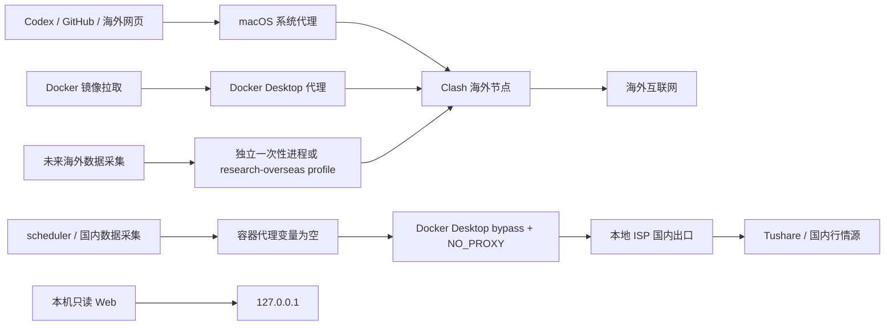

# 本地 Mac 开发与数据采集网络路径

> 日期：2026-07-28（Asia/Shanghai）
>
> 适用目录：`/Users/john/Desktop/shaiwei/shaiwei_init`
>
> 状态：当前基线已验证；未来海外数据容器仅为设计边界，尚未施工。

## 一句话结论

不修改 Mac 的公网地址，也不在“国内/海外网络”之间反复手工切换；按进程和容器职责分流：Codex、
GitHub、海外网页与镜像拉取走 Clash 海外代理，A股生产采集走本地 ISP 国内直连，未来海外数据采集
另立隔离进程或 Docker profile。

## 网络拓扑



核心原则是控制面、国内生产数据面和海外研究数据面物理分责，不让同一常驻服务根据目标网站临时
切换代理。

## 流量矩阵

| 流量 | 执行位置 | 网络路径 | 当前状态 |
| --- | --- | --- | --- |
| Codex 桌面端 | macOS | 系统代理 → Clash → 海外节点 | 已使用 |
| GitHub、海外论文/文档 | macOS | 系统代理 → Clash → 海外节点 | 已使用 |
| Docker 镜像拉取 | Docker Desktop | Docker Desktop代理 → Clash → 海外节点 | 已使用 |
| Tushare日增量 | scheduler容器 | 空代理变量 → bypass/`NO_PROXY` → 本地ISP | 已验证 |
| Sina/Eastmoney/Baostock | 国内采集容器 | 空代理变量 → bypass/`NO_PROXY` → 本地ISP | 已配置 |
| 本机只读Web | Web容器/浏览器 | `127.0.0.1`，不需要外部出口 | 已使用 |
| 宿主临时国内采集 | 受控一次性命令 | 进程级直连，不改变全局代理 | 按需使用 |
| 未来海外数据API | 独立进程/profile | 显式代理 → Clash → 海外节点 | 尚未施工 |

## 当前已验证基线

### 1. macOS 与 Clash

当前安全基线是让 Codex 桌面端继续使用 macOS 系统代理。即使 Clash 保持现有全局代理模式，国内生产
采集也可以由 Docker 的独立绕过路径直连，因此不需要为了跑批关闭 Clash或修改整个系统的公网出口。

如果未来将 Clash 改为规则模式，顺序应是：已登记国内数据域名 `DIRECT`、本地地址 `DIRECT`、中国
大陆域名/IP `DIRECT`、其余 `PROXY`。这只是可选优化；在验证 Codex持续连接、Docker直连和镜像拉取
三者同时正常前，不替换当前已验证基线。

### 2. 国内生产采集容器

`compose.yaml` 对生产和开发采集容器显式设置：

- `HTTP_PROXY`、`HTTPS_PROXY`、`ALL_PROXY` 及其小写形式为空；
- `NO_PROXY`/`no_proxy` 包含当前已用国内数据域名；
- Tushare客户端还会窄化追加 `api.waditu.com`，作为第二层保护。

当前 allowlist：

```text
api.waditu.com
*.waditu.com
*.sina.com.cn
*.eastmoney.com
*.baostock.com
localhost
127.0.0.1
```

Docker Desktop 的代理绕过名单必须包含同一组域名，因为 Docker Desktop网络后端与容器环境变量是
两层配置。以后接入上交所、深交所、巨潮或中证指数等国内官方源时，先确认真实主机名，再同时追加
到 Compose 与 Docker Desktop bypass；不得直接使用宽泛的 `*.cn`。

### 3. Docker 镜像与依赖

镜像仓库、海外包仓库和代码托管域名不加入国内 bypass。它们继续通过 Docker Desktop代理和 Clash
下载。这样“构建需要海外网络”和“运行采集需要国内网络”不会互相覆盖。

### 4. 宿主机临时命令

只有冻结协议明确允许宿主执行时，才使用项目 `.venv` 或 `curl --noproxy` 做一次性国内采集。直连应
限定在该进程和目标域名，不切换 Clash全局状态、不关闭系统代理、不改系统路由，也不把代理地址或
凭据写进命令记录、`.env.example`、Compose或Git。

## 未来海外数据采集

海外数据源不应直接加入当前 scheduler。正式接入前另立目标，建议采用：

1. 独立 `research-overseas` Docker profile 或一次性容器；
2. 只对该服务显式注入代理地址，禁止继承到 scheduler；
3. 国内与海外数据源分服务、分失败域、分网络诊断和分账本来源；
4. 产物仍只写项目目录内的不可变数据与追加式账本；
5. 海外代理失败不得使国内日增量降级，国内数据失败也不得自动改走海外出口；
6. 若容器需要访问宿主 Clash，只开放最窄的本机/Docker访问面，不开启不受限的局域网代理。

在真实海外数据源、域名、频率和授权确定前，不预先创建常驻代理容器。

## 诊断顺序

2026-07-28 已用仓库现有脱敏入口实测：`api.waditu.com` 交易日历返回8行、耗时461ms；容器内
HTTP/HTTPS/ALL三类代理均未设置，`tushare_no_proxy=true`。该检查不写数据或账本，证明本文所述
国内容器直连路径在归档时有效。

### 国内数据失败

先运行只读且脱敏的：

```bash
make docker-network-check
```

如果 Tushare约20秒后返回空表，优先怀疑流量仍经海外代理：检查 Docker Desktop bypass 与 Compose
`NO_PROXY` 是否一致。不要先重启 scheduler或关闭 Clash。

### Codex或海外网页失败

只检查 macOS系统代理、Clash节点和海外线路；不要修改 scheduler的代理变量，也不要把 Tushare改为
海外出口。

### 镜像拉取失败但国内采集正常

检查 Docker Desktop代理和镜像仓库路径。国内采集正常说明 scheduler直连路径无须改动。

### 两类流量同时失败

再检查本地ISP、Clash进程、Docker Desktop网络后端和DNS。每次只改变一个变量，并记录改前/改后
结果，避免同时切模式、换节点和重启容器导致无法归因。

## 安全与运行纪律

- 禁止输出完整 `docker inspect`、`env` 或 `printenv`；它们可能包含注入容器的凭据；
- 网络诊断只报告代理是否设置、目标主机、状态、耗时和脱敏错误，不回显token、Webhook或签名；
- 不把代理端口、订阅地址、节点信息或密钥提交Git；
- 网络调整不等于数据门通过，任何新数据源仍须不可变采集、质量门和PIT审计；
- 不因临时网络故障自动改源、改路由、重启生产或补造数据；
- scheduler运行健康时，不为宿主开发便利改动其镜像、挂载或网络身份。
