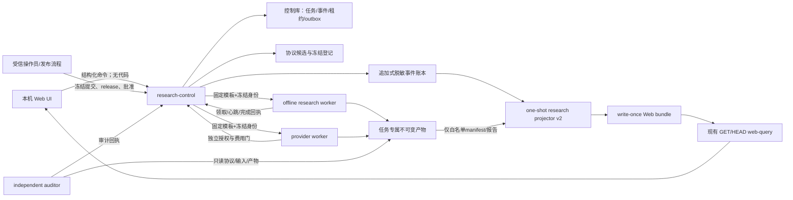
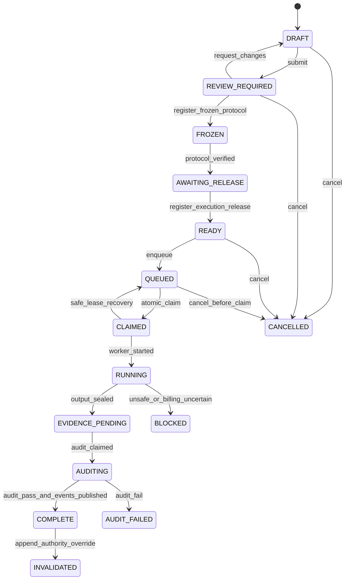

# M5 多票池策略工厂后台架构专项

> 日期：2026-08-05（Asia/Shanghai）
>
> 性质：后台架构设计，不是结果前研究协议，不授权真实研究运行
>
> 施工边界：本文件只定义可落地的任务控制面、证据面与阶段顺序；不改变任何既有股票池、因子、
> 模型、G1、生产策略或 Web 1.1 权威结论

## 1. 结论

“针对不同股票池，持续发现、验证、淘汰不同因子与策略”适合成为筛微的固定能力，但不能把现有
`web-query`从 GET/HEAD 只读服务直接改成能启动任意研究代码的控制器。建议新增独立的
`research-control`控制面，并保留现有证据链的四层隔离：

1. Web 只提交结构化研究意图和展示状态，不提交 Python、Shell、Docker 参数或生产配置；
2. 冻结协议与执行 release 仍是运行前硬门，研究结果不能反向改变协议；
3. 预登记模板映射到固定 Docker Worker，Worker 无 Docker socket、无生产写权限；
4. 独立审计通过后才发布只读投影，Web 不直接读取控制数据库、原始研究目录或结果账本。

当前可安全完成的最小闭环应命名为 **M5-0 多票池策略工厂合同与只读工程门**：只冻结数据模型、
状态机、模板注册、权限和查询契约，并用 synthetic fixture 证明“请求编译 → 协议候选 → 状态事件 →
只读投影”确定性可运行。M5-0 不增加写 HTTP、不启动常驻 Worker、不调用 DeepSeek、不计算真实因子
或收益。受控写入、离线 Worker、真实研究批分别进入 M5-1、M5-2、M5-3，不能夹带施工。

## 2. 现有真身与必须继承的边界

### 2.1 可直接复用

- `config/m1_multi_universe_v1.yaml`与`shaiwei.research.universe_registry`已经冻结股票池身份、PIT状态、
  当前允许动作和跨池评价身份；未知池、`.BJ`、身份混淆和PIT越权均失败关闭。
- 跨池评价身份已有十个必需字段：`factor_id`、`factor_version`、`universe_id`、`benchmark_id`、
  `label_id`、`horizon_id`、`neutralization_id`、`window_set_id`、`cost_policy_id`、
  `decision_rule_version`。M5不得发明缩短版身份。
- `shaiwei.ledger`已提供CSV自身`flock`、字段精确匹配和确定性主键冲突检查；已有运行账本证明相同
  主键同内容可复用、同主键异内容必须失败。
- 各研究臂已经形成“结果前协议 → execution release → 一次性Docker运行 → 不可变报告/Parquet →
  运行/决策账本 → 独立审计”的可信模式。
- `shaiwei.web.research_projection`已证明一次性断网投影器可只读账本与白名单证据、生成write-once
  bundle/manifest；常驻`web-query`只读投影，不扫描原始研究目录。
- 现有HTTP响应有统一包络、`snapshot_id`/ETag、1 MiB上限、未知枚举和证据变化失败关闭等可复用
  约定。

### 2.2 不能直接扩展

- M1-0注册表是一个冻结历史版本，不是可原地改写的“当前状态表”。例如后续M3规则池已另有GO
  证据，而M1-0仍保留`RULES_NOT_FROZEN`。M5必须通过新的版本或追加式状态覆盖表达演进，不得静默
  改写M1-0。
- `ledger/experiments.csv`和各研究专属账本schema不同，能承载研究证据，但不是具备事务租约、超时
  回收和并发领取能力的任务队列。
- `research_projection.py`已经是超过600行的热点且包含多类硬编码适配器。M5不得继续向该文件增加
  任务调度、写API或更多研究臂解析职责；新能力应使用统一M5结果包络和新的投影模块。
- `compose.research.yaml`当前按研究批逐项定义一次性服务，隔离可信但重复度高；不能把服务名、命令、
  挂载或环境变量开放为Web请求字段。
- 当前Web验收的安全前提正是 GET/HEAD-only、无认证写面、数据挂载只读、无`.env`和无Docker
  socket。直接给现有`web-query`增加POST会同时推翻接口、容器和威胁模型三项既有结论。

## 3. 目标架构



依赖方向固定为：

`领域合同 → 控制服务/Worker/Auditor适配层 → 证据投影 → HTTP/UI`

领域合同不得反向依赖FastAPI、Docker、`.env`、Web页面或生产scheduler。

## 4. 服务与权限边界

### 4.1 现有 `web-query`：保持纯只读

允许新增经过冻结的GET/HEAD查询，但不允许：

- 添加POST/PUT/PATCH/DELETE；
- 挂载控制数据库、协议草稿目录、Worker输出写目录或`.env`；
- 直接领取任务、启动Docker、修改账本或选择“最佳”策略；
- 根据原始结果自行计算RankIC、收益、成本、准入状态或任务状态。

### 4.2 新 `research-control`：唯一命令入口

- 单独模块、镜像、Compose profile和内部网络；不复用`shaiwei.web.api`进程。
- 无Docker socket、无行情原始目录、无研究结果写权限、无生产scheduler控制权限。
- 只持有控制SQLite、协议草稿/候选目录和脱敏事件outbox的窄写权限。
- M5-1仅监听Docker内部网络，由本机`web-ui`代理；不得直接暴露宿主端口或接入当前未完成安全加固的
  远程MultiCa入口。
- 所有命令必须有`Idempotency-Key`、期望事件序号和严格schema；不接受自由命令、任意路径、任意
  容器名、环境变量或模块名。

### 4.3 Worker：固定模板执行器

不让控制器持有Docker socket。后续按风险拆为固定lane的长驻或一次性Docker Worker：

| lane | 网络 | 凭据 | 输入 | 输出 | 初始并发 |
| --- | --- | --- | --- | --- | --- |
| `OFFLINE_FIXTURE` | none | 无 | synthetic fixture | `/tmp`或专属测试根 | 1 |
| `OFFLINE_RESEARCH` | none | 无 | 冻结只读数据manifest | 任务专属结果根 | 1 |
| `PROVIDER_LLM` | 仅批准的provider出口 | 独立Docker secret | 固定知识摘要；禁止封存结果 | 原始响应忽略区+脱敏回执 | 1 |
| `INDEPENDENT_AUDIT` | none | 无 | 协议、manifest、结果均只读 | 任务专属审计报告 | 1 |

Worker镜像只内置已登记adapter，不解释Web传来的命令字符串。`template_id + template_version`必须
在镜像内映射到固定入口、资源级别、允许挂载和输出schema；未知模板或镜像不匹配必须在领取前阻断。

### 4.4 独立 Auditor

- 与产生结果的Worker使用不同入口，不能调用Worker的最终裁决函数；
- 根文件系统只读、网络none、输入和研究产物只读，只允许写独立audit目录；
- 重算文件hash、行数/schema、协议/输入/release绑定、候选集合、门成员及最终裁决；
- 审计FAIL只产生`AUDIT_FAILED`，不得删除或覆盖原结果；修复必须新协议或明确恢复协议；
- 只有审计PASS且事件outbox全部发布后，`authority_status`才可成为
  `AUTHORITATIVE_CURRENT`或`AUTHORITATIVE_STOP`。

## 5. 最小数据模型

控制面第一版使用项目内SQLite，例如`data/control/m5/research_control.sqlite3`。它解决事务、唯一键、
租约和并发领取，但不替代不可变研究证据；文件位于项目内、Git忽略、可从追加式事件与产物manifest
重建。启用WAL、foreign keys、`busy_timeout`和`BEGIN IMMEDIATE`。

### 5.1 `research_tasks`

任务当前投影和不可变请求身份：

| 字段 | 约束/语义 |
| --- | --- |
| `task_id` | `sha256('m5-task-v1\0' + request_sha256)`或等价确定性ID，主键 |
| `idempotency_key_hash` | 唯一；只存hash，不回显原值 |
| `request_sha256` | canonical请求hash；同幂等键异hash返回409 |
| `template_id/template_version` | 严格注册模板，不是Python入口 |
| `universe_set_sha256` | 结果前冻结的有序股票池集合 |
| `factor_definition_sha256` | 精确公式/定义身份；发现任务可先为空但候选锁定后不可改 |
| `research_stage` | `DATA_GATE/DISCOVERY/REVIEW/EFFECT/G1/FORWARD_ENGINEERING` |
| `resource_class` | `FIXTURE/CPU_LIGHT/CPU_HEAVY/PROVIDER` |
| `current_state/current_event_seq` | 事件流的可重建缓存，不是权威研究裁决 |
| `protocol_sha256/release_sha256/input_manifest_sha256` | 达到相应阶段后只填一次 |
| `created_at/created_by_hash` | UTC带时区；操作身份脱敏hash |
| `production_authorization` | M5默认且持续为`none`；不允许Web更改 |

任务表不得放IC、收益、回撤、证券清单、原始prompt/response、secret或绝对路径。

### 5.2 `research_task_events`

追加式权威控制事件：

`event_id, task_id, event_seq, event_type, from_state, to_state, recorded_at,
actor_kind, actor_id_hash, command_sha256, payload_sha256, prev_event_sha256, event_sha256`

- `(task_id,event_seq)`与`event_id`唯一；同任务hash链连续；
- payload只引用项目相对manifest/hash，不内嵌研究值；
- 禁止UPDATE/DELETE；撤销、恢复和失效均追加新事件；
- 事务outbox把已提交事件发布到脱敏`ledger/m5_research_task_events.csv`。如果进程在CSV追加后、outbox
  确认前崩溃，重放依靠`event_id`同内容幂等收敛；同ID异内容失败关闭。

### 5.3 `research_attempts`

每次工程执行独立计数：

`attempt_id, task_id, attempt_no, lane, lease_owner_hash, lease_token_hash,
lease_expires_at, execution_release_sha256, image_digest, code_snapshot_sha256,
input_manifest_sha256, started_at, finished_at, terminal_status, billing_status,
output_manifest_sha256, failure_manifest_sha256`

研究尝试数、评价单元数和工程重试数必须分开：

- LLM完成响应计全局生成尝试；
- 同候选×不同股票池是不同评价单元，不是新的生成尝试；
- 进程崩溃后的安全恢复是同任务的工程attempt，不得改变研究N。

### 5.4 `research_approvals`

`approval_id, task_id, approval_kind, scope_sha256, decision, actor_id_hash,
recorded_at, expires_at, replaces_approval_id`

`approval_kind`只允许：`PROTOCOL_FREEZE`、`EXECUTION_RELEASE`、`PROVIDER_BUDGET`、
`RUN_START`、`AUDIT_ACCEPTANCE`。批准只对精确`scope_sha256`有效；公式、股票池、预算、输入或release
任一变化必须产生新批准。撤销用新记录，不改旧行。

### 5.5 `research_artifacts`与`research_audits`

- `research_artifacts`登记`artifact_id/attempt_id/kind/relative_path/sha256/bytes/row_count/schema_id`；
- `research_audits`登记`audit_id/task_id/attempt_id/auditor_release_sha256/report_sha256/status/
  authority_status/research_decision/failed_gate_ids/recorded_at`；
- artifact物理文件不进SQLite；表中只放相对路径和身份；
- `research_decision`与任务执行成功分离：成功运行可以得到`NO_GO/REJECT/STOP`，不能被标为FAILED；
- `production_authorization`不从研究决策推导，始终单独为`none`。

### 5.6 `control_outbox`

`outbox_id, event_id, ledger_schema_version, payload_json, published_at, publish_attempts`

这是唯一允许更新发布状态的操作表；payload在同事务内与事件生成。CSV发布器不读取研究结果目录，
只写预先创建的单个账本文件自身，避免扩大`ledger/`父目录写权限。

## 6. 协议冻结与任务身份

### 6.1 Web请求不是冻结协议

Web创建的是`DRAFT`，可生成一个canonical协议候选，但只有以下条件全部满足才进入`FROZEN`：

1. 股票池注册版本及当前证据覆盖已绑定；
2. 研究stage对应的必需字段完整，封存窗口不可读标志明确；
3. 生成尝试N、候选数、目标池集合、多重检验域和费用上限已冻结；
4. 协议文件已通过受信流程提交/推送，记录`protocol_git_commit`与物理SHA；
5. `PROTOCOL_FREEZE`批准精确绑定上述hash。

M5初期不允许容器访问`.git`或GitHub凭据。Web只显示“待冻结”；由现有受信施工/发布流程完成提交，
再通过窄CLI登记commit。未来若改为签名内容寻址协议库，必须另立治理协议，不能静默取消Git先行门。

### 6.2 执行release

`execution_release`至少绑定：

- task/protocol/template/universe registry版本与SHA；
- adapter版本、实现Git commit、代码bundle SHA、Docker image digest；
- 输入manifest和封存读权限；
- lane、资源上限、网络、secret与输出白名单；
- 恰好运行次数、安全恢复规则、预算批准与生产授权none。

没有release或Worker镜像身份不一致时只能保持`AWAITING_RELEASE`，不能“先跑再补”。

## 7. 控制状态机

`control_state`描述流程，研究结论放在独立字段，避免把REJECT误写成运行失败。



硬约束：

- `CANCELLED`只允许在Worker未开始前；开始后只能请求停止并写`STOPPED/BLOCKED`证据；
- `COMPLETE`只表示工程与审计闭环完成，其`research_decision`可以是GO、NO_GO、REJECT或STOP；
- `INVALIDATED`保留原数字、报告和事件，追加权威继任关系；
- 未知状态、跳跃状态、旧`expected_event_seq`或不匹配`from_state`均409并零写入；
- Web不得提供“重开REJECT”“调整门槛后重试”命令。新机制必须新task/protocol并累计研究N。

## 8. API契约

### 8.1 现有只读服务新增查询候选

以下接口仍只消费write-once投影bundle：

| 方法与路径 | 用途 |
| --- | --- |
| `GET /api/v1/research/universes` | 股票池身份、PIT状态、证据时点、当前最高允许动作 |
| `GET /api/v1/research/templates` | 可用研究模板、stage、资源类、所需批准；不返回模块/命令 |
| `GET /api/v1/research/tasks` | 状态、股票池、研究家族、进度、结论、阻断原因、分页筛选 |
| `GET /api/v1/research/tasks/{task_id}` | 事件时间线、协议/release/manifest/audit身份和证据链接 |
| `GET /api/v1/research/matrix` | 股票池×因子/机制矩阵；每格独立authority与NOT_EVALUATED |

响应沿用`schema_version/request_id/data/meta`、snapshot ETag、1 MiB上限和`Cache-Control:no-store`。
目录不返回原始payload、完整公式源码、证券列表、provider响应、绝对路径或表现排序。

### 8.2 独立控制API（M5-1以后）

| 命令 | 最低角色 | 说明 |
| --- | --- | --- |
| `POST /control/v1/research/tasks` | `RESEARCH_PROPOSER` | 创建严格DRAFT；必须有Idempotency-Key |
| `POST /control/v1/research/tasks/{id}/commands/submit` | `RESEARCH_PROPOSER` | 固定当前request SHA并进入复核 |
| `POST .../commands/register-frozen-protocol` | `PROTOCOL_APPROVER` | 登记已提交推送的协议commit/SHA |
| `POST .../commands/register-release` | `RUN_OPERATOR` | 登记镜像/release/输入manifest精确身份 |
| `POST .../commands/enqueue` | `RUN_OPERATOR` | 校验批准、预算、资源与保护窗口后排队 |
| `POST .../commands/cancel` | `RUN_OPERATOR` | 只在未领取状态取消 |

所有命令请求包含：

```json
{
  "expected_event_seq": 7,
  "command_id": "客户端确定性UUID或hash",
  "scope_sha256": "64位小写SHA-256",
  "reason": "受限枚举或短文本"
}
```

返回`202 Accepted`只代表命令入账，不代表研究通过；权威状态以随后GET投影为准。固定错误码：

- `409 IDEMPOTENCY_CONFLICT/STATE_CONFLICT`；
- `422 CONTRACT_INVALID/UNIVERSE_NOT_ELIGIBLE`；
- `423 APPROVAL_REQUIRED/PRODUCTION_GUARD_ACTIVE/BILLING_UNCERTAIN`；
- `503 PROJECTION_NOT_READY/WORKER_RELEASE_NOT_READY`。

### 8.3 身份与角色

首版角色为`VIEWER`、`RESEARCH_PROPOSER`、`PROTOCOL_APPROVER`、`RUN_OPERATOR`、`AUDITOR`。
`PRODUCTION_RELEASE`明确不属于M5。单用户本机不能虚构“两人复核”，应诚实表述为逻辑职责隔离：
协议先行hash、独立审计容器和不同命令阶段；未来远程多人化后再要求不同主体签署。

本机proposal-only阶段可依赖loopback与短会话CSRF保护；一旦开放真实执行或远程访问，必须先完成
认证、会话、CSRF、Origin校验、速率限制和命令审计。未完成前MultiCa不得调用控制API。

## 9. 队列、并发与失败恢复

### 9.1 领取与租约

1. Worker以lane和自身release身份请求任务；
2. 控制器`BEGIN IMMEDIATE`，按`priority, created_at, task_id`选择一个`QUEUED`任务；
3. 单条条件UPDATE写`CLAIMED`、随机lease token hash和`lease_expires_at`；只有受影响行数为1才成功；
4. Worker定期心跳续租；控制器只接受当前token、attempt和单调时间；
5. 同一任务同时最多一个有效研究lease和一个后续audit lease。

两Worker并发领取fixture必须证明只有一个获得任务；SQLite锁超时返回可重试503，不能重复建attempt。

### 9.2 幂等身份

- 创建：`idempotency_key_hash + request_sha256`；
- 排队：`task_id + release_sha256 + input_manifest_sha256`形成`run_key`唯一；
- attempt：`run_key + attempt_no`；
- 产物：manifest内容hash；
- 事件/账本：`event_id`；
- 投影：所有源hash形成`snapshot_id`。

相同身份完成后再次调用只做全量hash复核并返回`idempotent_reuse=true`，不得重新计算；身份相同但
内容不同一律CONFLICT。

### 9.3 租约过期分类

- 尚未开始外部调用、没有产物：可自动回到QUEUED，追加`LEASE_EXPIRED_SAFE_REQUEUE`；
- 已有write-once checkpoint且协议明确`safely_resumable=true`：新工程attempt只从下一缺失序号继续；
- provider请求已发出但完成/计费不确定：`BLOCKED_BILLING_UNCERTAIN`，禁止自动重发；
- 已生成研究结果但证据发布失败：进入`EVIDENCE_PENDING`，只能走报告复用闭环，禁止重算；
- 独立审计失败：`AUDIT_FAILED`，保留全部证据，按独立恢复协议处理；
- OOM、磁盘不足、输入hash漂移、`.BJ`、权限越界：失败关闭，不自动提高资源或换输入追成功。

### 9.4 资源与生产优先级

- 初始每个lane并发1，CPU-heavy全局并发1；不能因队列变长自动扩容；
- 生产日增量与模拟仓永远优先。控制器通过只读生产守护投影判断保护窗口和当日闭环，不直接操作
  scheduler；保护期间CPU-heavy任务不领取，已运行任务只允许安全停止点，不强杀写入中任务；
- adapter必须声明CPU、内存、预计时长、网络和费用上限；Worker实际限制不得高于release；
- 不同股票池评价可排队，但不能并行读取同一高负载数据集；先按Mac 24GB约束串行。

## 10. 不可变产物与目录

建议目录只位于项目内：

```text
data/
  control/m5/                         # SQLite/WAL，Git忽略
  research/factory/
    protocols/<protocol_sha256>/      # canonical冻结副本，write-once
    tasks/<task_id>/
      attempts/<attempt_id>/staging/  # 未完成，不得投影
      artifacts/<manifest_sha256>/    # 原子rename后的不可变产物
      audits/<audit_report_sha256>/    # 独立审计
  web/research_factory_snapshots/     # bundle+manifest，write-once
ledger/
  m5_research_task_events.csv         # 脱敏、追加式、Git可跟踪
  m5_research_decisions.csv           # 审计通过后的任务/评价单元裁决
```

产物manifest至少包含协议/release/代码/输入/股票池注册hash、task/attempt/run key、每个文件相对路径、
SHA-256、字节、行数、schema、开始/完成时间、候选和评价单元计数、外部调用/费用身份、确定性复跑身份。
禁止绝对路径、secret、Webhook、token、完整环境变量和未脱敏provider正文。

staging失败不得覆盖或伪装成正式产物；失败manifest也write-once。正式目录只通过同文件系统原子rename
形成。清理策略不得删除任何已被账本、manifest、审计或投影引用的文件。

## 11. 只读投影 v2

为M5新建按职责拆分的投影包，而不是继续扩大`research_projection.py`：

- `projection/source_reader.py`：相对路径、symlink、稳定切片和hash校验；
- `projection/task_projection.py`：任务状态与事件链；
- `projection/universe_projection.py`：注册版本、追加式状态覆盖和最高允许动作；
- `projection/result_projection.py`：统一M5结果包络、评价单元与authority；
- `projection/builder.py`：bundle/manifest、write-once发布；
- `query/research_factory.py`：纯查询筛选与分页。

投影输入只允许：M5脱敏事件/决策账本、股票池注册版本、冻结协议身份、artifact manifest和audit report。
不挂raw Parquet、SQLite控制库、provider原始响应、持仓或生产写目录。

统一结果包络必须将以下字段分开：

- `engineering_status`；
- `audit_status`；
- `research_stage`与`research_decision`；
- `authority_status`；
- `strategy_effective`；
- `production_authorization`；
- `generated_attempt_n`、`evaluation_cell_count`、`engineering_attempt_count`。

股票池×因子矩阵每格的严格身份是现有十字段评价键；缺任一字段只能`NOT_EVALUATED`。不得从其他池
继承结论，不做跨不可比fingerprint表现排序，不把`REJECT`、`STOP`或`INVALIDATED`隐藏为空态。

## 12. M5-0 当前可安全完成的最小闭环

### 12.1 允许施工

1. 冻结`m5-strategy-factory-contract-v1`，定义本文件中的状态、事件、模板与API schema；
2. 新建严格领域模型：`ResearchTaskRequest`、`ResearchTemplate`、`TaskEvent`、`EvaluationIdentity`、
   `ArtifactManifest`、`AuditEnvelope`；全部`extra=forbid/frozen`；
3. 新建模板注册表v1，只登记`fixture-no-result-v1`和未来模板元数据；不登记任意命令；
4. 新建股票池“版本+状态覆盖”解析合同，但M5-0只读M1-0与后续已登记证据fixture，不改M1-0；
5. 实现纯内存/synthetic状态机和canonical request→task/protocol candidate编译器；
6. 实现one-shot synthetic投影和GET查询fixture，验证bundle write-once、分页、状态/坏消息不丢；
7. 回归锁定现有P3服务仍拒绝所有写方法，Compose仍只读且无新增控制挂载。

### 12.2 M5-0明确禁止

- 不创建真实控制SQLite或写HTTP；
- 不启动常驻controller/Worker/auditor；
- 不写真实任务、研究账本或production ledger；
- 不调用DeepSeek/Tushare/外网，不读取`.env`；
- 不计算真实因子、标签、IC、收益、回撤、持仓或排名；
- 不改变M4-1 REJECT、正式因子库0、中证800唯一生产策略和任何P0调度；
- 不从Web commit/push、build/promote镜像或启动Docker研究任务。

### 12.3 M5-0通过条件

- canonical双跑task/protocol/event/bundle hash完全一致；
- 非法股票池、PIT越权、`.BJ`、缺失评价键、未知模板、任意命令字段、非法状态跳转全部fail closed；
- 幂等键同请求复用、异请求冲突；两并发fixture只有一个状态转移成功；
- synthetic结果明确`strategy_effective=NOT_EVALUATED`、`production_authorization=none`；
- 新生产文件按职责拆分且常态不超过400行，不向现有热点增加职责；
- 全仓、专项、Ruff、compileall、pip check、Compose、脱敏和P3只读回归PASS；
- scheduler容器、镜像、创建时间和healthy状态不变。

M5-0终态只能是`GO_STRATEGY_FACTORY_CONTRACT_AND_READ_ONLY_FIXTURE_ONLY`。

## 13. 分阶段施工清单

### M5-1 · proposal-only 控制面

- 创建项目内SQLite、事务事件/outbox和独立`research-control`；
- 仅开放create draft、submit、cancel-before-freeze；不允许freeze/release/enqueue；
- `web-ui`本机代理，补CSRF/Origin/限流/会话和完整命令审计；
- 构建真实任务状态投影，但任务最多停在`REVIEW_REQUIRED`；
- 故障注入覆盖事务提交前后、outbox与CSV追加之间的崩溃恢复。

终态：`GO_PROPOSAL_ONLY`，仍为零Worker、零真实研究。

### M5-2 · 离线Worker与独立审计工程门

- 实现内部领取/心跳/租约/reaper和固定`OFFLINE_FIXTURE` Worker；
- 实现冻结协议/release登记的受信CLI，不由Web自动批准；
- synthetic任务两Worker竞争、进程中断、安全续跑、产物封存、独立审计、投影闭环；
- 证明controller/Worker/auditor均无Docker socket、无生产写挂载、无外网；
- 再加入一个“不读取效果”的真实数据/预执行模板做工程门。

终态：`GO_OFFLINE_WORKER_ENGINEERING_ONLY`。

### M5-3 · 首个真实多池研究模板

- 选择一个具有合法PIT数据的池和独立经济机制，结果前冻结目标池、候选、N、窗口、成本和裁判；
- 先锁定模板adapter/release/输入manifest，再允许唯一真实运行；
- 独立审计后发布矩阵和详情；无论GO/REJECT/STOP都原样显示；
- 不自动进入模型、模拟仓、前瞻或生产。

### M5-4 · Provider/LLM lane

- 单独用户授权provider、模型、响应数和批次/累计费用上限；
- provider secret仅进入该Worker的Docker secret；控制/Web/投影均不可见；
- 复用已有语义合同、transport、billing uncertain和同批不递补规则；
- 原始行情、证券清单、封存结果和其他凭据不得发送给LLM。

### M5-5 · Web受控“发起研究”正式能力

- 只有M5-1/2真实稳定和安全审计通过后，页面才开放freeze/release/enqueue请求；
- 批准动作仍需对应角色与精确scope hash，不提供“一键最佳策略/一键上线”；
- Web展示排队、运行、证据待发布、审计、REJECT/STOP、阻断和投影延迟；
- 远程开放、多人RBAC和MultiCa接入另立安全目标；默认仍为本机。

生产接入不属于M5-5。历史通过后仍须独立前瞻协议、模拟账户和生产release授权。

## 14. 必须覆盖的测试矩阵

### 合同与身份

- 未登记股票池、错误官方身份、自建池冒充指数、PIT未就绪越权、`.BJ`；
- 评价十字段缺失/多余/重排、结果后增加股票池、候选formula hash冲突；
- template/version、protocol/release/image/input任一身份漂移。

### 状态与并发

- 每条合法/非法状态边；旧event seq、重复命令、同幂等键异请求；
- 两Worker并发领取恰一成功；心跳过期、旧lease token、ABA attempt；
- cancel与claim竞态；结果封存与cancel竞态；审计重复提交。

### 故障恢复

- 数据库提交前/后崩溃；CSV追加后outbox未确认；
- staging部分文件、原子rename前后、manifest缺项/漂移；
- provider请求前、请求后无响应、完成但账本未写、计费不确定；
- 结果完成但证据发布失败，只允许报告复用；
- audit FAIL后不得重算或覆盖。

### 安全与投影

- P3全部POST继续405；control无Docker socket/生产挂载/`.env`；
- Worker拒绝任意命令、路径逃逸、symlink、绝对路径和未知输出；
- 投影输入变化重试后仍不稳定则CONFLICT，bundle/manifest篡改失败；
- secret、token、Webhook、环境变量、原始prompt/response、证券列表和绝对路径不进入HTTP或Git；
- REJECT、STOP、INVALIDATED、NOT_EVALUATED和审计失败均可见且不被表现排序隐藏。

### 资源与生产隔离

- CPU-heavy在保护窗口不领取；同类任务串行；OOM不自动抬资源；
- 施工前后scheduler容器/镜像/创建时间/健康完全一致；
- Web和研究控制故障不影响每日跑批；生产故障优先阻断研究领取。

## 15. 主要风险与裁决建议

| 风险 | 裁决 |
| --- | --- |
| 把现有只读API直接扩成写服务 | 拒绝；新增独立control服务 |
| Web传入任意Python/命令/Docker参数 | 拒绝；只允许冻结模板ID |
| 用CSV直接做并发任务队列 | 拒绝；SQLite事务队列，CSV只做脱敏追加证据 |
| SQLite变成研究结论真身 | 拒绝；结论仍由协议、产物、账本和独立审计构成 |
| M1-0原地更新为“当前” | 拒绝；版本化注册+追加状态覆盖 |
| 持续向`research_projection.py`加适配器 | 拒绝；统一M5包络和分模块projection v2 |
| Worker拥有Docker socket或生产写挂载 | 拒绝；固定lane容器和模板 |
| 租约过期自动重发外部请求 | 拒绝；billing uncertain人工阻断 |
| 研究GO自动进入模拟仓/生产 | 拒绝；前瞻与生产均为独立目标和授权 |
| 当前MultiCa远程入口调用控制面 | 暂不允许；待TLS、认证、RBAC和审计另验 |

最终建议是：先完成M5-0的合同与只读fixture工程门，再做M5-1 proposal-only。这样可以马上把多票池
研究变成统一、可展示、可复用的产品结构，同时不提前引入最危险的写API、远程执行和任意代码面。
